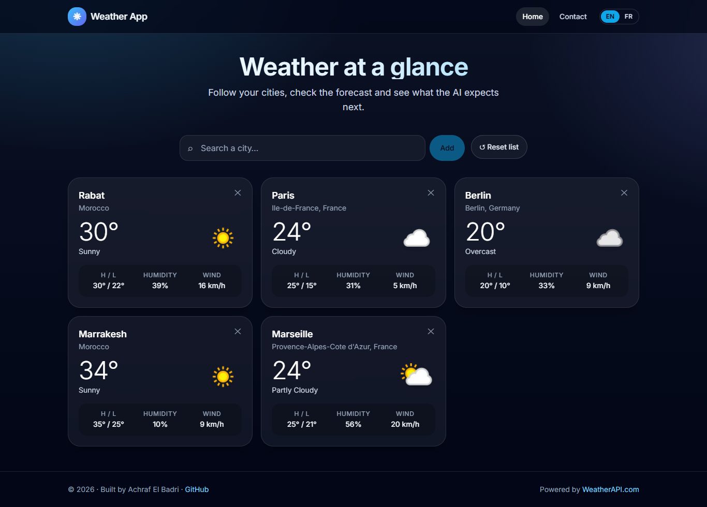
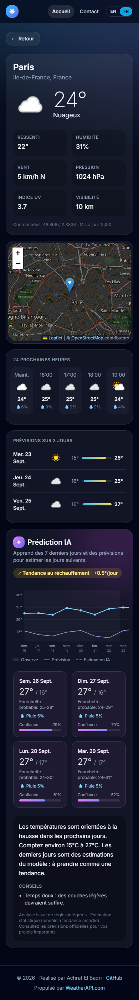
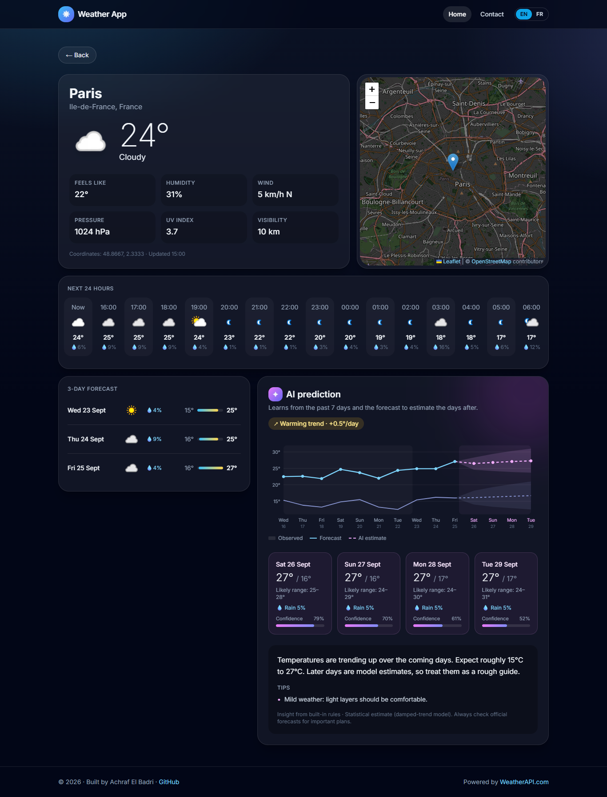

# Weather App: live weather + AI predictions (EN/FR)

A modern, mobile-friendly weather dashboard built with **Next.js + Tailwind CSS**, backed by a small **Node/Express API** that keeps your API keys secret and adds an **AI prediction** of the coming days.

| Desktop | Mobile |
|---|---|
|  |  |



## Features

- 🌤️ Current weather for your cities (5 defaults + search to add your own; saved in your browser)
- 🔎 City search with autocomplete (keyboard and touch friendly)
- 📍 City page: detailed conditions, interactive map, next 24 hours, 3-day forecast
- ✦ **AI prediction**: learns from the past 7 days + forecast to estimate the 4 days after, with a trend, an uncertainty range, rain chance and a confidence score, plus a written summary and tips (by Claude if configured, otherwise built-in rules)
- 🌍 English / French, auto-detected from the browser, switchable in the header (weather descriptions are translated too)
- 📱 Responsive design, from phones to large screens
- ✉️ Contact form handled by Netlify Forms (no database)
- 🔐 API keys live **only** on the server, in one place

## Architecture

```
Browser ──▶ client/ (Next.js static site, hosted on Netlify)
               │  fetch
               ▼
            server/ (Express API, hosted on Render)  ──▶ WeatherAPI.com
               │                                     ──▶ Claude API (optional)
            keys in server/.env (local) or Render env vars (prod)
```

**Do I need MongoDB Atlas?** No. The only data the app stores is your list of cities, and that lives in the browser's `localStorage`. Weather data is fetched live and cached in the server's memory. You'd only need a database if you add user accounts to sync cities across devices.

### Where the API keys live

All keys are read in **one file**, [server/src/config.js](server/src/config.js), from environment variables:

| Variable | Where | Required |
|---|---|---|
| `WEATHER_API_KEY` | `server/.env` locally, Render dashboard in production | ✅ ([free key](https://www.weatherapi.com/signup.aspx)) |
| `ANTHROPIC_API_KEY` | same | optional: enables Claude-written insights |
| `ALLOWED_ORIGINS` | same | your front-end URL(s) |
| `NEXT_PUBLIC_API_URL` | `client/.env.local` locally, Netlify dashboard in production | URL of the server (not a secret) |

`.env` files are git-ignored, so keys never reach GitHub.

### How the AI prediction works

1. The server fetches the last 7 days of observed weather and the 3-day forecast.
2. A **damped-trend exponential smoothing** model (Holt's method), see [forecastModel.js](server/src/ai/forecastModel.js), learns the level and trend of daily highs/lows and extends them 4 more days. Its past errors give an 80% uncertainty band that widens with distance. Rain chance comes from recent wet days.
3. The numbers are turned into a short summary + practical tips, written by **Claude** (`claude-opus-5`) when `ANTHROPIC_API_KEY` is set, or by built-in rules otherwise. Results are cached for 1 hour per city and language to keep costs low.

## Run locally

Requirements: Node.js 20+.

```bash
# 1. API server
cd server
cp .env.example .env        # then put your WeatherAPI key in .env
npm install
npm run dev                 # http://localhost:4000/api/health

# 2. Front-end (in a second terminal)
cd client
cp .env.example .env.local  # NEXT_PUBLIC_API_URL=http://localhost:4000
npm install
npm run dev                 # http://localhost:3000
```

Run the model tests with `cd server && npm test`.

## Deploy

### 1. Back-end on Render
1. Push this repo to GitHub.
2. On [Render](https://dashboard.render.com): **New → Blueprint**, select the repo. It reads [render.yaml](render.yaml).
3. Fill in the secrets it asks for: `WEATHER_API_KEY`, optionally `ANTHROPIC_API_KEY`, and `ALLOWED_ORIGINS` (put your Netlify URL there once you have it, e.g. `https://my-weather-app.netlify.app`).
4. Note the service URL, e.g. `https://weather-app-api.onrender.com`, and check `/api/health` returns `{"ok":true}`.

> Render's free plan sleeps after 15 minutes of inactivity; the first request then takes up to ~1 minute. The app shows a "waking up the server" banner meanwhile.

### 2. Front-end on Netlify
1. On [Netlify](https://app.netlify.com): **Add new site → Import an existing project**, select the repo. Settings come from [netlify.toml](netlify.toml) (base `client`, publish `out`).
2. Under **Site configuration → Environment variables**, add `NEXT_PUBLIC_API_URL` = your Render URL, then redeploy.
3. Update `ALLOWED_ORIGINS` on Render with the final Netlify URL.
4. Contact form messages appear under **Netlify → Forms** (enable form detection if asked).

## API

| Endpoint | Description |
|---|---|
| `GET /api/health` | Status + whether Claude insights are enabled |
| `GET /api/weather?q=Paris&lang=fr` | Current weather + 3-day forecast (hourly included) |
| `GET /api/search?q=Par` | City autocomplete |
| `GET /api/predict?q=Paris&lang=en` | AI prediction (observed, forecast, predicted days, trend, insight) |

## Tech stack

Next.js 14 (static export) · React 18 · Tailwind CSS · Leaflet / OpenStreetMap · Express 5 · WeatherAPI.com · Claude API (optional)

## Credits

Created by **Achraf El Badri**. Weather data by [WeatherAPI.com](https://www.weatherapi.com/). Map data © OpenStreetMap contributors.
