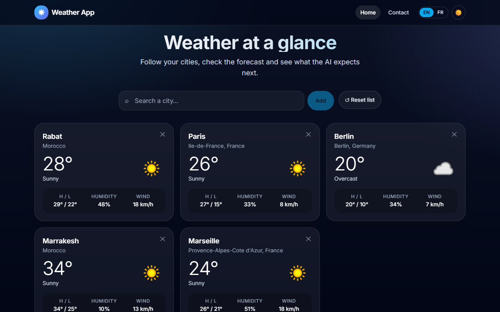
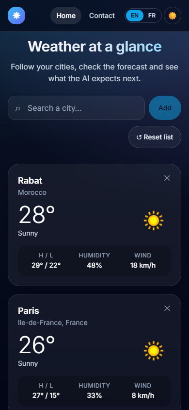
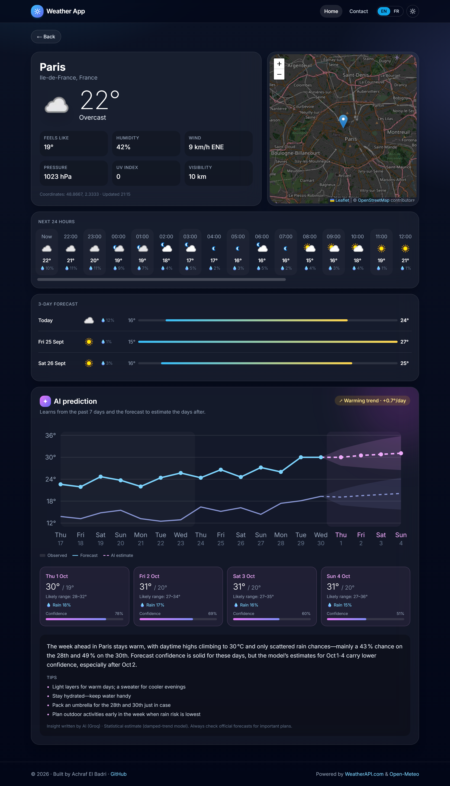
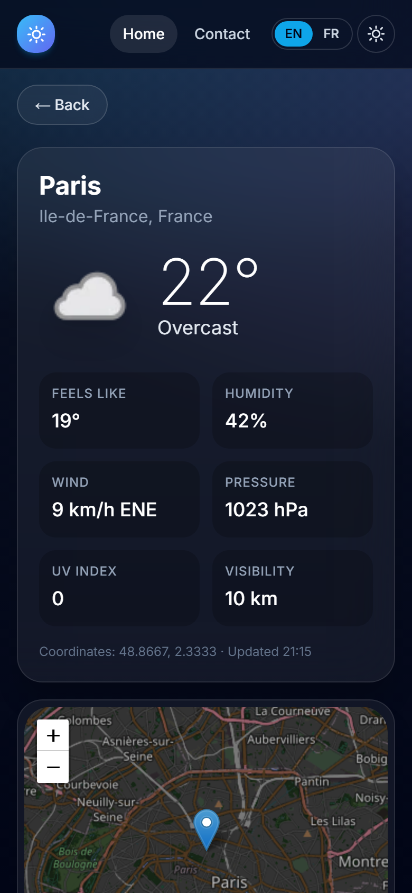
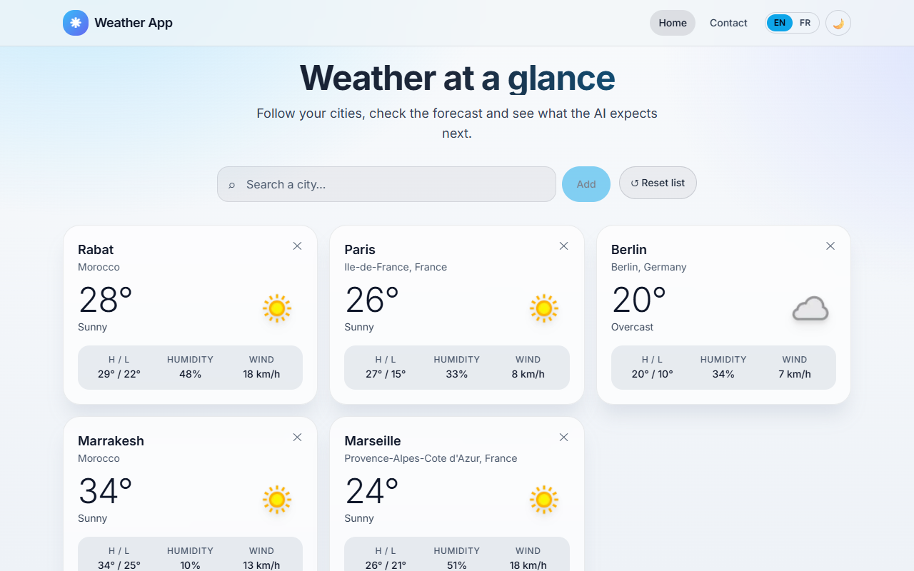
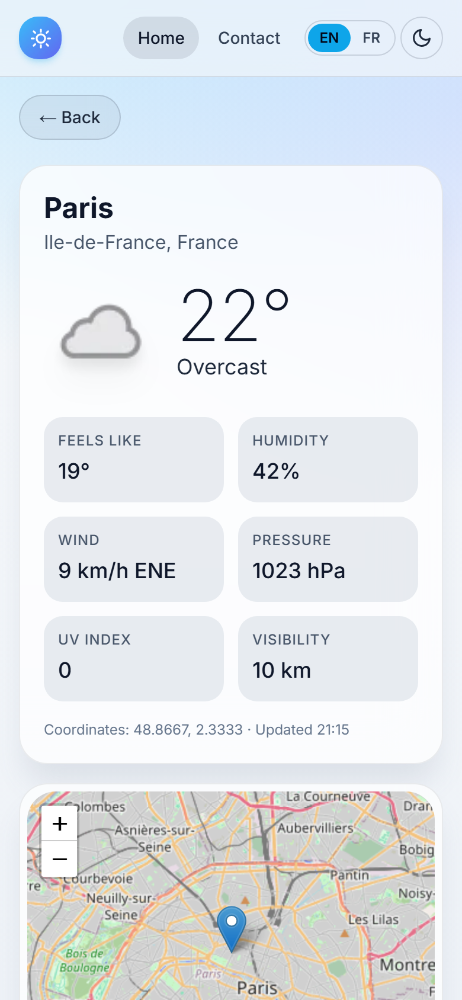

# Weather App: live weather + AI predictions (EN/FR)

A modern, mobile-friendly weather dashboard built with **Next.js + Tailwind CSS**, backed by a small **Node/Express API** that keeps the API keys secret and adds an **AI prediction** of the coming days.

**Live demo:** [achrafweather.netlify.app](https://achrafweather.netlify.app/)

## Screenshots

<table>
  <tr>
    <th></th>
    <th>Desktop</th>
    <th>Mobile</th>
  </tr>
  <tr>
    <td><b>Home</b></td>
    <td></td>
    <td></td>
  </tr>
  <tr>
    <td><b>City details</b></td>
    <td></td>
    <td></td>
  </tr>
  <tr>
    <td><b>Light mode</b></td>
    <td></td>
    <td></td>
  </tr>
</table>

## Features

- Current weather for your cities: 5 defaults, plus search to add your own (saved in your browser)
- City search with autocomplete (keyboard and touch friendly)
- City page: detailed conditions, interactive map, next 24 hours and a **3-day forecast**
- **AI prediction**: learns from the past 7 days and the 7-day forecast to estimate the 4 days after, with a trend, an uncertainty range, rain chance and a confidence score, plus a short written summary and practical tips
- English / French, auto-detected from the browser and switchable in the header (weather descriptions are translated too)
- Light and dark mode, following the system setting by default
- Responsive design, from phones to large screens
- Confirmation dialogs and toast notifications (close with the X, swipe up, or wait 4 seconds)
- Contact form that emails you each message, with anti-spam protection
- API keys live **only** on the server, in one place

## Architecture

```
Browser ──▶ client/ (Next.js static site, hosted on Netlify)
               │  fetch
               ▼
            server/ (Express API, hosted on Render)  ──▶ WeatherAPI.com (current, hourly, days 1-3, history)
               │                                     ──▶ Open-Meteo (days 4-7, no key needed)
               │                                     ──▶ Groq API (AI summary, optional)
               │                                     ──▶ Resend (contact emails, optional)
            keys in server/.env (local) or Render env vars (prod)
```

**Do I need MongoDB Atlas?** No. The only data the app stores is your list of cities, and that lives in the browser's `localStorage`. Weather data is fetched live and cached in the server's memory. A database would only be needed for user accounts that sync cities across devices.

### Where the API keys live

All keys are read in **one file**, [server/src/config.js](server/src/config.js), from environment variables:

| Variable | Where | Required |
|---|---|---|
| `WEATHER_API_KEY` | `server/.env` locally, Render dashboard in production | yes ([free key](https://www.weatherapi.com/signup.aspx)) |
| `GROQ_API_KEY` | same | optional: AI-written summary instead of the built-in rules ([free key](https://console.groq.com)) |
| `RESEND_API_KEY` | same | optional: enables contact form emails ([free account](https://resend.com)) |
| `CONTACT_TO_EMAIL` | same | the address that receives contact messages |
| `ALLOWED_ORIGINS` | same | your front-end URL(s) |
| `NEXT_PUBLIC_API_URL` | `client/.env.local` locally, Netlify dashboard in production | URL of the server (not a secret) |

`.env` files are git-ignored, so keys never reach GitHub.

### How the AI prediction works

1. The server fetches the last 7 days of observed weather and the 7-day forecast.
2. A **damped-trend exponential smoothing** model (Holt's method), see [forecastModel.js](server/src/ai/forecastModel.js), learns the level and trend of daily highs/lows and extends them 4 more days. Its past errors give an 80% uncertainty band that widens with distance. Rain chance comes from recent wet days.
3. The numbers are turned into a short summary and practical tips, either by a language model (when `GROQ_API_KEY` is set) or by built-in rules. Results are cached for 1 hour per city and language.

## Run locally

Requirements: Node.js 20+.

```bash
# 1. API server
cd server
cp .env.example .env        # then put your WeatherAPI key in .env
npm install
npm run dev                 # http://localhost:4000/api/health

# 2. Front-end (in a second terminal)
cd client
cp .env.example .env.local  # NEXT_PUBLIC_API_URL=http://localhost:4000
npm install
npm run dev                 # http://localhost:3000
```

Run the server tests with `cd server && npm test`.

## Deploy

### 1. Back-end on Render
1. Push this repo to GitHub.
2. On [Render](https://dashboard.render.com): **New → Blueprint**, select the repo. It reads [render.yaml](render.yaml).
3. Fill in the secrets it asks for: `WEATHER_API_KEY`, optionally `GROQ_API_KEY`, `RESEND_API_KEY` + `CONTACT_TO_EMAIL` (contact emails), and `ALLOWED_ORIGINS` (your Netlify URL once you have it, e.g. `https://my-weather-app.netlify.app`).
4. Note the service URL, e.g. `https://weather-app-api.onrender.com`, and check that `/api/health` returns `{"ok":true}`.

> Render's free plan sleeps after 15 minutes of inactivity; the first request then takes up to about a minute. The app shows a "waking up the server" banner meanwhile.

### 2. Front-end on Netlify
1. On [Netlify](https://app.netlify.com): **Add new site → Import an existing project**, select the repo. Settings come from [netlify.toml](netlify.toml) (base `client`, publish `out`).
2. Under **Site configuration → Environment variables**, add `NEXT_PUBLIC_API_URL` = your Render URL, then redeploy.
3. Update `ALLOWED_ORIGINS` on Render with the final Netlify URL.

## Contact form emails

Each message sent from the Contact page is emailed to `CONTACT_TO_EMAIL` with the subject **"[Weather App] Nouveau message de &lt;name&gt;"**. Hitting *Reply* in your mailbox answers the visitor directly.

1. Create a free account on [Resend](https://resend.com) (3,000 emails/month) with the address where you want to receive messages.
2. **API Keys → Create API key**, then set `RESEND_API_KEY` and `CONTACT_TO_EMAIL` in `server/.env` (and on Render).
3. Without your own domain, Resend sends from `onboarding@resend.dev` and can only deliver to your Resend account's email, which is exactly what this form needs. With a verified domain you can also set `CONTACT_FROM_EMAIL`.

Spam protection: a hidden honeypot field, input validation, and a limit of 5 messages per 15 minutes per visitor.

## API

| Endpoint | Description |
|---|---|
| `GET /api/health` | Status, and whether AI summaries and contact emails are enabled |
| `GET /api/weather?q=Paris&lang=fr` | Current weather, hourly data and `daily` (7-day forecast) |
| `GET /api/search?q=Par` | City autocomplete |
| `GET /api/predict?q=Paris&lang=en` | AI prediction (observed, forecast, predicted days, trend, summary) |
| `POST /api/contact` | Contact form: `{ name, email, message }` → email to `CONTACT_TO_EMAIL` |

## Tech stack

Next.js 14 (static export) · React 18 · Tailwind CSS · Leaflet / OpenStreetMap · Express 5 · WeatherAPI.com · Open-Meteo · Resend · Groq API (optional)

## Credits

Created by **Achraf El Badri**. Weather data by [WeatherAPI.com](https://www.weatherapi.com/) and [Open-Meteo](https://open-meteo.com/) (CC BY 4.0). Map data © OpenStreetMap contributors.
